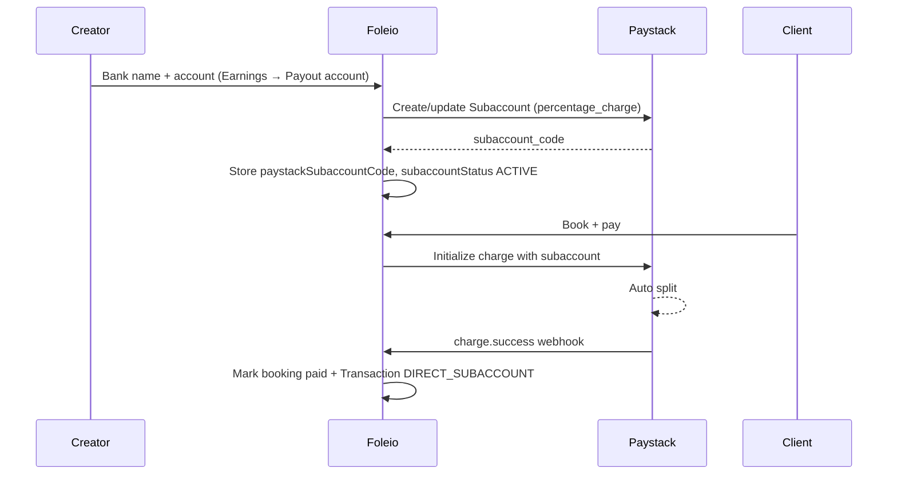

# Paystack subaccount setup (bookings)

How Foleio splits booking payments: platform keeps a fee (`percentage_charge`), the rest settles to the creator’s bank via a Paystack subaccount (auto / T+1). This replaces platform-held 60/40 escrow for creators on the subaccount path.

## Money model

| Party | What they get |
|-------|----------------|
| Client | Pays full booking amount |
| Foleio | `FOLEIO_PLATFORM_FEE_PERCENT` (default **5%**) via Paystack `percentage_charge` |
| Creator | Remainder, settled by Paystack to their bank (`settlement_schedule: auto`) |

Foleio never holds the creator’s share for subaccount bookings. Earnings “Available” is only for legacy / non-subaccount ledger balances; booking splits show under **Settled to bank**.



## Ops prerequisites (Paystack dashboard)

1. Activate Paystack business for **live** subaccount settlements (Phase 1 — ops only).
2. Set API keys on the app (see env below).
3. Webhook URL: `https://your-domain.com/api/webhooks/paystack`
4. Subscribe at least to **`charge.success`**.

## Environment

```env
PAYSTACK_SECRET_KEY=sk_...
NEXT_PUBLIC_PAYSTACK_PUBLIC_KEY=pk_...
PAYSTACK_WEBHOOK_SECRET=...
# Platform fee kept on subaccount charges (Paystack percentage_charge). Default: 5
FOLEIO_PLATFORM_FEE_PERCENT=5
NEXT_PUBLIC_APP_URL=https://your-domain.com
```

Also used for legacy withdraw UI (separate from subaccount settlement):

```env
MANUAL_PAYOUTS_ENABLED=true
NEXT_PUBLIC_MANUAL_PAYOUTS_ENABLED=true
```

## Creator onboarding (bank → subaccount)

**UI:** Earnings → **Payout account** tab ([`BankSetupForm`](apps/web/components/creator/BankSetupForm.tsx))

**API:** `POST /api/creator/bank/save` ([`route.ts`](apps/web/app/api/creator/bank/save/route.ts))

Flow:

1. Creator searches bank, enters 10-digit NUBAN.
2. `POST /api/creator/bank/verify-account` resolves account name via Paystack.
3. On save:
   - Create/update **transfer recipient** (legacy transfers).
   - Create or **update** Paystack **subaccount** (`createSubaccount` / `updateSubaccount` in [`lib/paystack.ts`](apps/web/lib/paystack.ts)):
     - `business_name`, `settlement_bank`, `account_number`
     - `percentage_charge` = `FOLEIO_PLATFORM_FEE_PERCENT`
     - `settlement_schedule` = `auto`
   - Persist on `Creator`:
     - `paystackSubaccountCode`
     - `subaccountStatus: ACTIVE`
     - `payoutMethod: DIRECT_SUBACCOUNT`
   - Upsert `BankAccount` row.

Without an **ACTIVE** subaccount, public profile Book CTA is blocked (“Payments not set up yet”).

## Booking checkout (charge with split)

1. Client creates booking → `POST /api/bookings/create`.
2. Client initializes payment → `POST /api/bookings/initialize-payment`:
   - Requires creator `paystackSubaccountCode` + `subaccountStatus === ACTIVE` (fail closed).
   - `paystack.initializePayment` with:
     - full amount (kobo)
     - `subaccount`
     - `metadata`: `{ type: 'booking', bookingId, paymentType: 'DIRECT_SUBACCOUNT', ... }`
   - Returns `access_code` / `authorization_url` / `reference`.
3. [`BookingModal`](apps/web/components/booking/BookingModal.tsx) opens Paystack via `access_code` (`resumeTransaction`) or setup fallback.

Tutorials / collections / generic payments already pass `subaccount` when present; bookings now require it.

## After payment (webhook / verify)

**Webhook:** `POST /api/webhooks/paystack` on `charge.success` when `metadata.type === 'booking'`.

**Client verify:** `POST /api/bookings/verify-payment`.

Both:

1. `confirmBookingPayment` → booking `paid`.
2. `recordBookingPaymentTransaction` → upsert `Transaction`:
   - `type: booking`
   - `paymentType: DIRECT_SUBACCOUNT`
   - `creatorEarnings` / `platformFee` from fee %
   - `fundsReleased: true`
3. Advance booking to `first_payout_done` **without** crediting Foleio ledger balances.
4. **Skip** `processFirstPayout` (old 60% escrow credit).
5. Send confirmation email.

## Earnings page meaning

| Stat | Meaning |
|------|---------|
| **Available** | Withdrawable on Foleio (non–`DIRECT_SUBACCOUNT` ledger − payouts) |
| **Settled to bank** | Booking (and similar) splits already paid out by Paystack |
| **Total earned** | Ledger + settled |
| **Paid out** | Successful Foleio withdrawal requests |

Bank setup lives only on Earnings → **Payout account** (not Settings).

## Key files

| File | Role |
|------|------|
| [`apps/web/lib/paystack.ts`](apps/web/lib/paystack.ts) | `createSubaccount`, `updateSubaccount`, `initializePayment` |
| [`apps/web/app/api/creator/bank/save/route.ts`](apps/web/app/api/creator/bank/save/route.ts) | Recipient + subaccount create/update |
| [`apps/web/components/creator/BankSetupForm.tsx`](apps/web/components/creator/BankSetupForm.tsx) | Dark dash bank UI |
| [`apps/web/app/api/bookings/initialize-payment/route.ts`](apps/web/app/api/bookings/initialize-payment/route.ts) | Init charge with subaccount |
| [`apps/web/components/booking/BookingModal.tsx`](apps/web/components/booking/BookingModal.tsx) | Client Paystack with access_code |
| [`apps/web/app/api/webhooks/paystack/route.ts`](apps/web/app/api/webhooks/paystack/route.ts) | `charge.success` booking path |
| [`apps/web/app/api/bookings/verify-payment/route.ts`](apps/web/app/api/bookings/verify-payment/route.ts) | Client-side verify |
| [`apps/web/lib/actions/booking.ts`](apps/web/lib/actions/booking.ts) | `confirmBookingPayment`, `recordBookingPaymentTransaction` |
| [`apps/web/components/creator/EarningsDashboard.tsx`](apps/web/components/creator/EarningsDashboard.tsx) | Balances + payout account tab |
| [`apps/web/components/creator/PublicCreatorProfile.tsx`](apps/web/components/creator/PublicCreatorProfile.tsx) | Book CTA gated on ACTIVE subaccount |

## Creator schema fields

- `paystackSubaccountCode` — Paystack `ACCT_…` code  
- `subaccountStatus` — `INACTIVE` \| `PENDING_CREATION` \| `ACTIVE`  
- `payoutMethod` — `DIRECT_SUBACCOUNT` after bank save  

## Admin

| Surface | What to check |
|---------|----------------|
| `/admin/creators` | **Payments** column: Subaccount ready / status / No bank |
| `/admin/transactions` | Filter **Subaccount split**; platform fee + creator share columns |

## Out of scope / leftovers

- Migrating historical escrow balances  
- Creator **Withdraw** button (removed from Dashboard + Earnings)  
- Redesigning light `PayoutModal` (unused from Earnings)  
- Non-booking product checkouts (already optional subaccount when present)  
